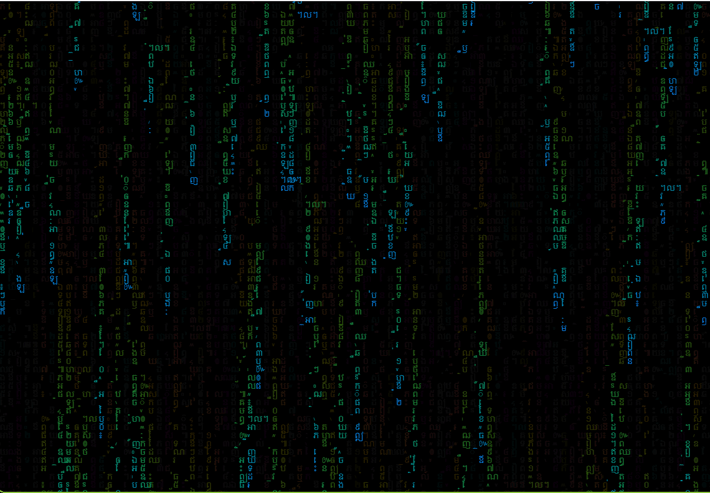

# Lively Matrix Khmer
Matrix like animation using HTML5 Canvas. Inspired from [sample code](http://thecodeplayer.com/walkthrough/matrix-rain-animation-html5-canvas-javascript) on [thecodeplayer.com](http://thecodeplayer.com/).

## Source Code
Forked from `https://github.com/bad1dea/lively_matrix`

## How to use as wallpaper in Windows
- Download and install Lively Wallpaper
- Clone this repo `git clone https://github.com/SethDeveloper/lively_matrix_khmer.git`
- Open Lively Wallpaper
- Click Add [+]
- Select Choose a File
- Browse to the cloned source code
- select index.html

## Images

## Original
See it in action @ http://parambirs.github.io/matrix

@ 2020-09-05 - added lively customizable options (rainbow / color select) - khuong